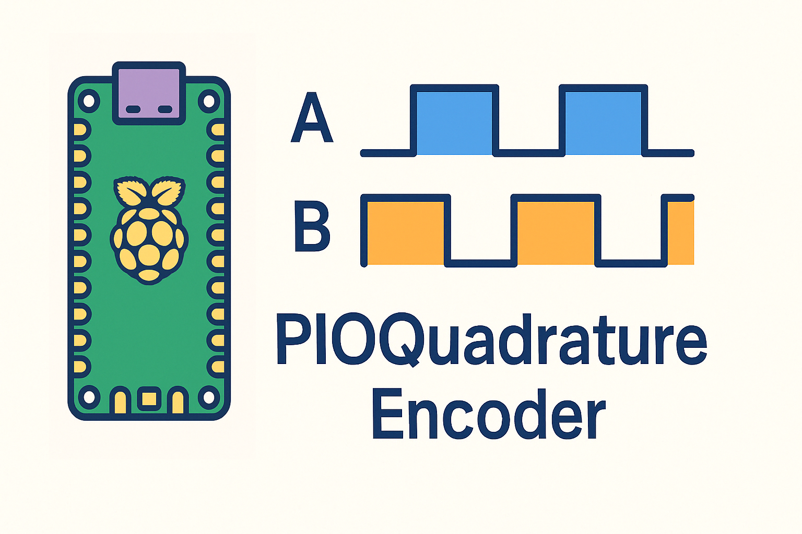

# PIO Quadrature Encoder Library for Raspberry Pi Pico/W and Pico2/W



A lightweight C++ library and example for reading rotary quadrature encoders using the RP2040’s PIO hardware, with support for up to **4 state‑machines per PIO block** (8 total on PIO0 + PIO1), an optional per‑encoder debug LED, and a lock‑free ring buffer.

---

## Table of Contents

- [Features](#features)  
- [Hardware Setup](#hardware-setup)  
- [Software Requirements](#software-requirements)  
- [Building](#building)  
- [Usage](#usage)  
  - [Class Usage](#class-usage)  
  - [Instantiating an Encoder](#instantiating-an-encoder)  
  - [Optional Debug LED](#optional-debug-led)  
  - [Reading Steps](#reading-steps)  
- [Multiple Encoders (PIO0 + PIO1)](#multiple-encoders-pio0--pio1)  
- [API Reference](#api-reference) 
- [Project Structure](#project-structure)
- [How to Use the Library in Another Project](#how-to-use-the-library-in-another-project)
- [License (Beerware)](#license-beerware)

---

## Features

- Pure‑C++ wrapper around RP2040/RP2350 PIO for quadrature decoding  
- Hardware‑driven: uses PIO IRQ0 vector, minimal CPU overhead  
- Supports up to 4 encoders on PIO0 and 4 on PIO1 (8 total)  
- Interrupt‑safe ring buffer (`EncoderRingBuffer`) for step events  
- Optional per‑encoder debug LED toggle on activity  
- Simple, API with drop‑in `main.cpp` example  

---

## Hardware Setup

1. **Encoder pins**  
   - Connect your encoder’s **phase A** to GP<n> and **phase B** to GP<n+1>.  
   - You can use up to four pairs on PIO0 and four on PIO1.

2. **(Optional) Debug LEDs**  
   - Wire each debug LED (with resistor) to a free GPIO.  
   - Call `enableDebugLed(pin)` before `init()` to have it blink on each step.

3. **Pull‑ups**  
   - On‑board or external pull‑ups on A and B lines help clean up the signal.

---

## Software Requirements

- Raspberry Pi Pico SDK (2.1.x or later)  
- CMake ≥ 3.13  
- GNU Make or Ninja  
- ARM GCC toolchain (arm-none-eabi‑gcc)  

---

## Building

```bash
git clone https://gitlab.metropolia.fi/josephh/pio_encoder.git
cd pio_encoder
mkdir build && cd build
cmake -DPICO_BOARD=<board type> ..
make -j$(nproc)
```
## Usage

### Class Usage

This project provides the `QuadratureEncoder` class for handling quadrature encoder inputs using PIO state machines. The `EncoderRingBuffer` class is used for storing step events in a lock-free, interrupt-safe buffer.

### Instantiating an Encoder

To create and initialize an encoder instance:

```cpp
QuadratureEncoder enc0(pio0, 0, 10);  // PIO0, state machine 0, encoder A on GPIO 10
enc0.init();
```
### Optional Debug LED
To enable an optional debug LED that toggles on each step:
```cpp
enc0.enableDebugLed(20);  // Debug LED on GPIO 20
```
### Reading Steps
Once initialized, the encoder will automatically process input. You can read steps with the following code:
```cpp
uint8_t step;
int64_t position = 0;
while (enc0.buffer().pop(step)) {
    position += static_cast<int8_t>(step);
    printf("Encoder position: %lld\n", position);
}
```
### Multiple Encoders (PIO0 + PIO1)

You can instantiate up to 8 encoders using the two PIO blocks (PIO0 and PIO1), with 4 encoders per block:
```cpp
QuadratureEncoder enc0(pio0, 0, 10);
QuadratureEncoder enc1(pio1, 3, 27);
```
### API Reference
```cpp
QuadratureEncoder::QuadratureEncoder(PIO pio, uint sm, uint pinA, float clkdiv)
```
Constructor for initializing the encoder on a given PIO state machine.

- `pio` - The PIO block (either pio0 or pio1).
- `sm` - The state machine number (0-3 per PIO block).
- `pinA` - The GPIO pin connected to phase A of the encoder.
- `clkdiv` - The clock divider for the state machine.

```cpp
void QuadratureEncoder::init()
```
Initializes the encoder, sets up the PIO state machine, and starts the interrupt handling.

```cpp
void QuadratureEncoder::enableDebugLed(uint32_t led_pin)
```
Enables the optional debug LED for this encoder.

```cpp
void QuadratureEncoder::disableDebugLed()
   ```
Disables the debug LED for this encoder.

```cpp
EncoderRingBuffer& QuadratureEncoder::buffer()
```
Returns the encoder's ring buffer, which holds the step events.

### Project Structure
The project structure is as follows
```makefile
.
├── CMakeLists.txt        # Main CMake file for the project
├── README.md             # Project documentation
├── main.cpp              # Example main application code
└── pio_encoder/          # Library for quadrature encoder handling
    ├── CMakeLists.txt    # CMake file for the PIO encoder library
    ├── include/          # Header files for the library
    │   ├── EncoderRingBuffer.h
    │   ├── GpioPin.h
    │   ├── QuadratureEncoder.h
    │   └── led.h
    └── src/              # Source files for the library
        ├── EncoderRingBuffer.cpp
        ├── GpioPin.cpp
        ├── QuadratureEncoder.cpp
        ├── led.cpp
        └── quadrature_encoder.pio
```
### How to Use the Library in Another Project

1. **Include the PIO Encoder Library**
   - In your main project, add the pio_encoder library as a subdirectory:
   - ```cmake 
      add_subdirectory(pio_encoder)
      ```
2. **Link the Library**
   - Link your project to the `pio_encoder` library: 
   - ```cmake
      target_link_libraries(your_target pio_encoder)
      ```
3. **Include the Headers**
   - In your source files, include the necessary headers from the `pio_encoder` library:
   - ```cpp
      #include "QuadratureEncoder.h"
      ```


### License (Beerware)
This project is licensed under the Beerware License. Feel free to use it for your personal or commercial projects, and if you find it useful, buy me a beer someday.


